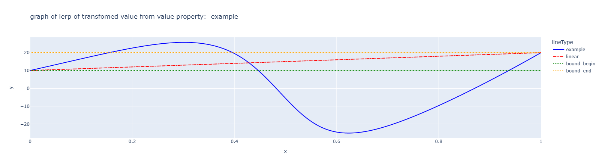
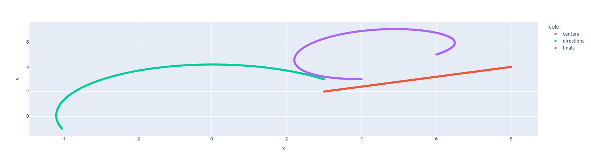
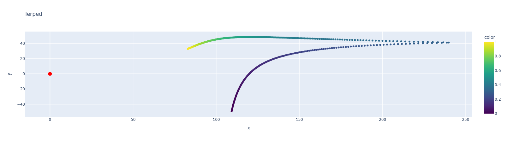
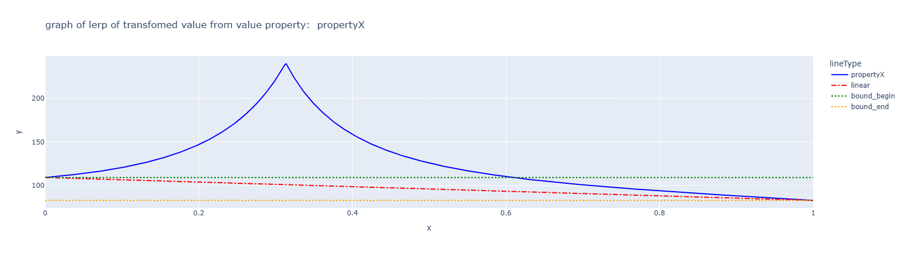
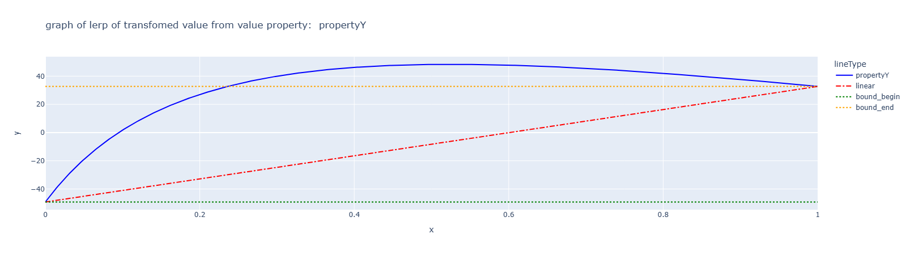

# Out Of Bound Interpolation (OOBI)
**OOBI** is a method of interpolation where the resulting values are not restricted to remain within the original bounds of the input data.  
Unlike traditional interpolation, which always stays inside the range defined by the data points, OOBI allows results that can be **below the minimum** or **above the maximum** bounds.

---

## How It Works

OOBI builds upon **classical interpolation techniques** (linear, quadratic, etc.), but the final interpolated value depends on additional parameters that influence how the interpolation behaves.

- The **input parameters** are first interpolated using a standard method.
- The **resulting value** is then computed according to the chosen configuration, which may lead to values outside the initial range.

---

## Versions of OOBI

OOBI is implemented in two different modes:

### 1. Point Position
- Values are interpolated using points that defines the proximity to the bounds.  
- This approach controls how much the interpolated result can diverge beyond the original range.

### 2. Curved Space
- Parameters are used to construct a function `float -> float` that is **not polynomial**.  
- This creates a non-linear interpolation space where the output is determined by custom non-linear mappings.

---

## Key Features
- Supports **classical interpolation techniques** (linear, quadratic, etc.).
- Produces values that can go **outside of the defined range**.
- Two different versions: **space-based interpolation** and **non-linear function-based interpolation**.
- Useful for applications where **unusual behavior** is required but still relies on interpolation mechanisms.

---

## Example Use Cases
- **Game design – alloy mixing**:  
  When mixing metals in a game, a simple linear interpolation of properties (like strength, density, or melting point) often feels too predictable and "boring."  
  OOBI allows more dynamic and surprising results, making alloy crafting systems more engaging.  

- **Real-life inspiration – lead-tin alloys (pewter)**:  
  In reality, the melting temperature of a lead-tin alloy can be *lower* than that of both pure lead and pure tin.  
  OOBI does not aim to simulate physics exactly, but it produces results that *feel* more realistic by mimicking such out-of-bound behaviors.

---

## License
This project is released under the [MIT License](LICENSE).